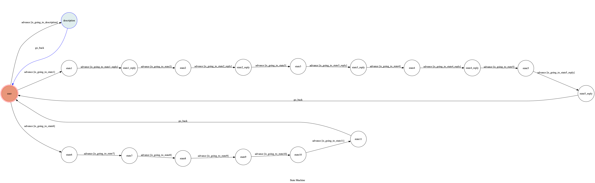

# TOC Project 2019

A Facebook messenger bot based on a finite state machine

輕鬆簡單的兩項心理小測驗

## Setup

### Prerequisite
* Python 3
* Facebook Page and App
* HTTPS Server

#### Install Dependency
```sh
pip3 install -r requirements.txt
```

* pygraphviz (For visualizing Finite State Machine)
    * [Setup pygraphviz on Ubuntu](http://www.jianshu.com/p/a3da7ecc5303)

#### Secret Data

`VERIFY_TOKEN` and `ACCESS_TOKEN` **MUST** be set to proper values.
Otherwise, you might not be able to run your code.

#### Run Locally
You can either setup https server or using `ngrok` as a proxy.

**`ngrok` would be used in the following instruction**

```sh
./ngrok http 5050
```

After that, `ngrok` would generate a https URL.

#### Run the sever

```sh
python3 app.py
```

## Finite State Machine


## Usage
* state 說明

	* 起始 state 為 `user`.
	* 輸入"1" 
		+ 進入 `state1` state，答完時進入該題目所有選項解釋的`state1_reply` state
		+ 在 `state1_reply` state輸入"next"，進入下一題`state2` state，依此類推
		+ 5題結束後，從 `state5_reply` state自動回到`user` state
	  
	* 輸入"2" 
		+ 進入 `state6` state，答完結束後進入下一題`state7` state
		+ 5題結束後，從 `state10` state進入測驗結果說明的 `state11` state，然後自動回到`user` state
	  
	* 輸入"help"
		+ 進入`description` state 並自動回到 `user` state


* 功能1：動物愛情心理測驗

	* 輸入 "1" 開始測驗
	* 共有5題，每答完一題可立即看到選項的解釋

* 功能2：隱藏悲傷指數測驗

	* 輸入 "2" 開始測驗
	* 共有5題，每題每個選項都有一個得分，答完一題時請記得你所選選項的得分
	* 5題結束時，會有測驗結果說明，將你所選選項的得分加總，依照你的總得分找對應的結果
	
* 功能3：簡易bot說明

	* 輸入: "help" 可查看bot的說明


## Author
[Alvin Chiu](https://github.com/alvinchiu0421/chatbot_2019)


## Reference
[TOC-Project-2019](https://github.com/winonecheng/TOC-Project-2019) & [TOC-Project 2018 FAQ](https://hackmd.io/tHi9mQJ-QTeMUsH1Xdhj7g?view)
